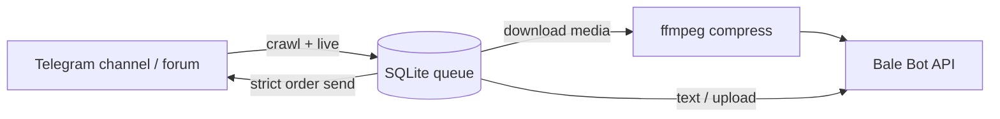

# Architecture

## Modes

| Mode | Flow |
|------|------|
| `daemon` | `run_crawl` (optional) → `run_send` loop → `run_live_watch` |
| `crawl` | Fill `queue` from Telegram history |
| `send` | Drain `pending` / `failed` rows |

## Forum routing

- `TOPIC_TO_BALE_MAPPING`: `topic_id->@bale_channel`
- `STRICT_TOPIC_ROUTING_SOURCES`: unmapped topics → `skipped`
- `INCLUDE_SEND_TOPIC_IDS`: optional crawl filter

## Media pipeline

1. Optional compress-before-upload
2. Bale multipart upload (retries on 5xx)
3. ffmpeg re-encode retry
4. Caption + `t.me/...` link fallback

## Profiles

| Profile | Env | DB |
|---------|-----|-----|
| Public channel | `.env.public` | `state.db` |
| Private forum | `.env.private` | `state_private.db` |

One process at a time (shared `session`).
