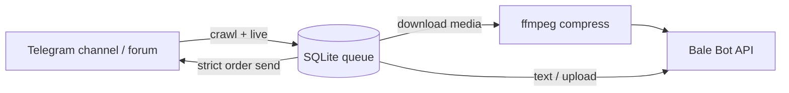

# Architecture

## Modes

| Mode | Flow |
|------|------|
| `daemon` | `run_crawl` (startup by default) → `run_send` loop → `run_live_watch` |
| `crawl` | Fill `queue` from Telegram history |
| `send` | Drain `pending` / `failed` rows |

## Forum routing

- `TOPIC_TO_BALE_MAPPING`: `topic_id->@bale_channel`
- `STRICT_TOPIC_ROUTING_SOURCES`: unmapped topics → `skipped`
- `INCLUDE_SEND_TOPIC_IDS`: optional crawl filter

## Media pipeline

1. Confidence tier from metadata (size/bucket): may skip to Telegram-link fallback
2. Optional compress-before-upload
3. Bale multipart upload (retry/backoff on transient errors)
4. ffmpeg re-encode retry
5. Oversized homogeneous albums skip `sendMediaGroup` and send per-part
6. Non-audio 413 (`Request Entity Too Large`) forces immediate Telegram-link fallback

## Startup behavior (important)

- On daemon restart, startup crawl re-scans Telegram history by default.
- Queue upsert is idempotent; already-sent rows are skipped during send.
- This catches new messages posted while bot was not running.
- Set `DAEMON_SKIP_CRAWL_IF_QUEUED=1` to disable this behavior.

## Profiles

| Profile | Env | DB |
|---------|-----|-----|
| Public channel | `.env.public` | `state.db` |
| Private forum | `.env.private` | `state_private.db` |

One process at a time (shared `session`).
